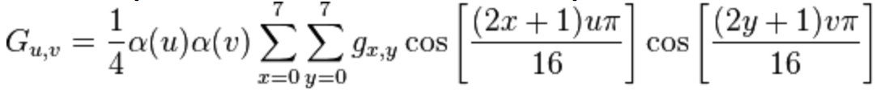
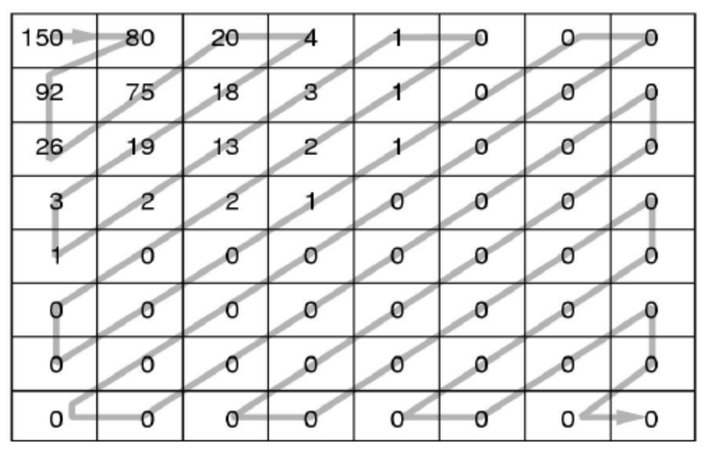
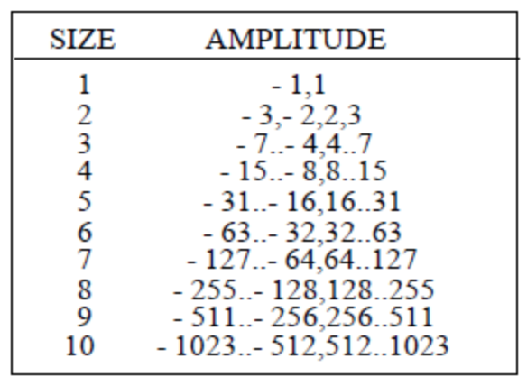

# PPM encoder/decoder

This is a basic implementation of a ppm image encoder/decoder.

## PPM P3 Format

This file format contains a small header of 3 lines (or more if there are comments - line which start with '#') specifying:
- the format: P3 (each pixel has 3 bytes, one for Red, one for Green, one for Blue and these bytes/numbers are written on separate lines as ASCII strings)
- the resolution of the image: width and height in pixels
- the maximum value of a byte component (red or green or blue): usually 255

After this header data bytes follow for each pixel in the image, starting from the top-left corner of the image, in ASCII format.

## Algorithm

The algorithm reads all the data from the ppm file and encodes it into a byte array.

### Part 1

- reading the PPM image and converting each pixel value from RGB to YUV
- forming 3 matrixes: one for Y components, one for U components and one for V components
- dividing the Y matrix into blocks of 8x8 values; each block stores: the 64 values/bytes from the block, the type of block (Y) and the position of the block in the image
- dividing the U and V matrixes into blocks of 8x8 values; each block stores: 4x4=16 values/bytes from the block (i.e. 4:2:0 subsampling, that is for each 2x2 U/V values store only one U/V value which should be the average of those 2x2=4 values)

### Part 2

- performing Forward DCT (Discrete Cosine Transform)
- Quantization on an 8x8 pixels block

*Forward DCT (Discrete Cosine Transform)* takes as input an 8x8 Y/Cb/Cr values block and transforms this block intro another 8x8 DCT coefficient block. The forward DCT is implemented using the following formula:



*Quantization* phase takes as input an 8x8 block of DCT coefficient and divides this block to an 8x8 quantization matrix obtaining an 8x8 quantized coefficients block, using the following quantization matrix:

```
                6   4   4   6   10  16  20  24
                5   5   6   8   10  23  24  22
                6   5   6   10  16  23  28  22
        Q =     6   7   9   12  20  35  32  25
                7   9   15  22  27  44  41  31
                10  14  22  26  32  42  45  37
                20  26  31  35  41  48  48  40
                29  37  38  39  45  40  41  40
```

### Part 3

- each block is first parsed in zig-zag order resulting an array of coefficients like this one:
```
150, 80, 92, 26, 75, 20, 4, 18, 19, 3, 1, 2, 13, 3, 1, 0, 1, 2, 2, 0, 0, 0, 0, 0, 1, 1, 0, 0, 0, 0, 0, 0, 0, 0, 0, 0, 0, 0, 0, 0, 0, 0, 0, 0, 0, 0, 0, 0, 0, 0, 0, 0, 0, 0, 0, 0, 0, 0, 0, 0, 0, 0, 0, 0
```
as depicted in the following image:



- the DC coefficient (i.e. the first value; e.g. 150) of this array is encoded in 2 bytes: (SIZE) and (AMPLITUDE) where AMPLITUDE is the actual value of the coefficient (i.e. 150) and SIZE is the number of bits necessary in order to represent AMPLITUDE according to the following table: 



- the remaining 63 AC coefficients of the block are encoded in the following way:
	- an AC coefficient with the value zero is skipped (is not encoded at all)
	- a non-zero AC coefficient is encoded in 3 bytes: (RUNLENGTH,SIZE)(AMPLITUDE) where RUNLENGTH is the number of consecutive zeroes that occur in front of this AC coefficient and SIZE and AMPLITUDE are the same as the ones defined for the DC coefficient above.
	- if the block ends with a consecutive sequence of zeroes, all these zero coefficients are skipped and instead of them we place the bytes (0,0) (2 bytes, END-OF-BLOCK code) in the encoders output.

For example, for the block depicted above, the output of the entropy encode would be:
```
(8)(150), (0,7)(80), (0,7)(92), (0,5)(26), (0,7)(75), (0,5)(20), (0,3)(4), (0,5)(18), (0,5)(19), (0,2)(3), (0,1)(1), (0,2)(2), (0,4)(13), (0,2)(3), (0,1)(1), (1,1)(1), (0,2)(2), (0,2)(2), (5,1)(1), (0,1)(1), (0,0)
```
